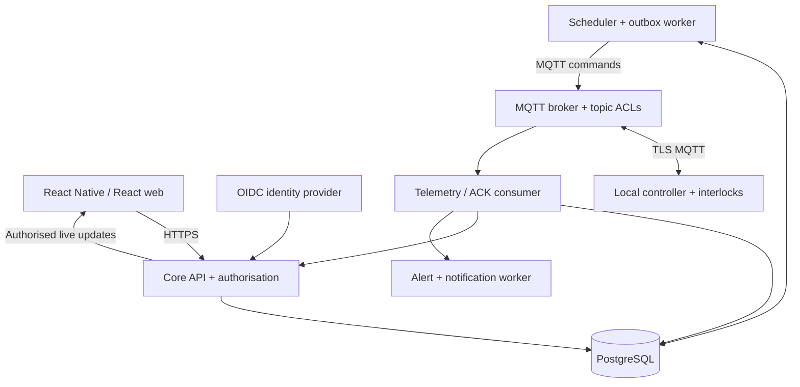
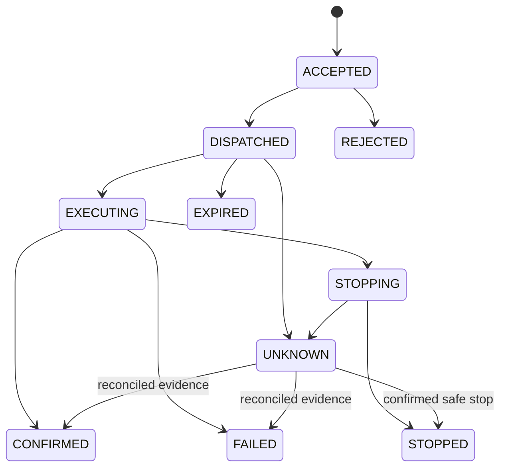

# AgroThulir — Product and Backend Design
Version 1.2 · 11 September 2026 · AgroThulir icon-led mobile concept delivered

[Open the new AgroThulir icon-led mobile design](https://www.figma.com/design/e5Tl0hv0DNr2gwgt1rGuFT)

[Open the legacy 68-screen functional reference](https://www.figma.com/design/DQv8P9cnkt2aotJNLLvIkB)

## 1. Delivery and scope

AgroThulir is a multi-corporate IoT management platform for farms, greenhouses, houses, reservoirs and other installations. The proposed mobile app uses React Native. The same backend serves a future React web app.

The new Figma file contains a cover and 14 editable, high-fidelity mobile screens for the core operator, flow, scheduling, corporate administration and super-administration journeys. It uses outlined vector icons throughout, with short labels retained for accessibility and safety. The theme uses forest green, ivory, sage, lime, amber, blue and red. All measurements, names and hardware details in the mockups are illustrative.

**Design status:** The AgroThulir icon-led mobile concept is complete in a new writable Figma file. Representative operator dashboard, physical topology and super-admin screens were visually inspected after creation. The legacy 68-screen file remains the detailed functional reference for secondary, setup, fault and empty states that are not yet redrawn in the new visual style. Prototype links, production code, backend, firmware and deployment are outside this design revision.

The design covers the requested operational model plus provisioning, maintenance, permissions, stale data and fault cases. Future hardware capabilities should enter through device/component schemas, rather than requiring a new application for every device type.

## 1.1 Confirmed brand

**App name: AgroThulir.** Preserve this spelling and capitalisation across the app, documents, notifications and future web frontend. The name combines agriculture with Tamil **துளிர்**, a new shoot or sprout. The project owner has confirmed the name; this is not a statement of trademark or domain registration.

- Proposed tagline: **Connected care. Growing possibilities.**
- Brand mark direction: a simple sprout with two leaves and a small connection node; readable as a single-colour mark at small sizes.
- Display name: AgroThulir. Technical slug and proposed MQTT prefix: `agrothulir`.
- Keep the existing forest, sage and ivory palette, with amber and red reserved for operational meaning.
- Retain generic terminology: Corporation, Site, Zone, Device and Component. A farming brand must still accommodate houses and other installations.

The MQTT prefix is a proposed contract change, not a deployed migration. If any hardware already uses a previous namespace, migrate explicitly with compatible broker ACLs and firmware configuration; do not silently strand existing devices.

## 1.2 Screen redesign specification — icons and concise content

**Application status: core design set created.** The new Figma file applies this direction to 14 priority mobile screens while retaining the original 68-screen set for functional reference. Future design expansion must preserve the same permission and interlock behaviour.

Use a consistent family of outlined SVG icons: 24 px navigation icons, 20 px action icons and 28–32 px equipment icons inside soft coloured tiles. Use approximately 2 px strokes at 24 px. Import actual vector paths; do not substitute emoji. Icons supplement short labels on primary navigation and safety-relevant actions.

| Screen group | Icon changes | Layout/content changes |
|---|---|---|
| A01–A07 · Access | Sprout brand mark, mail, lock, eye, shield, corporate building | Branded welcome illustration; compact labeled inputs; concise invitation and access messages |
| S01–S07 · Sites | Home, map pin, field/sprout, building, greenhouse, zone grid | Site cards with a leading type icon; separate metric tiles for moisture, pressure, water and energy |
| D01–D07 · Devices | Controller/chip, connectivity, QR scan, signal, chart, settings | Device identity row with icon and fresh-state badge; readings grid; compact component counts |
| C01–C09 · Components | Pump, valve, sensor, droplet, thermometer, power, shield | Recognisable component tiles; prominent confirmed state and primary action; expandable specifications |
| F01–F11 · Flows | Connected nodes, branch, pump, valve, check, timer, stop | Component icons in physical diagram; action icons in sequence nodes; pan, zoom and list-view tools |
| Q01–Q07 · Schedules | Calendar, clock, repeat, pause, play, conflict warning | Compact schedule cards with next run and recurrence; icon-led timing controls |
| M01–M10 · Administration | Corporate building, people, user-plus, site pin, shield, audit list | Icon-led summary tiles and admin menu; short action labels with clear tenant context |
| E01–E10 · Operations | Alert triangle, offline, tool, history, bell, retry | Leading severity icon and concise alert summary; details remain available on the alert screen |

### Shared navigation

| Item | Icon | Label policy |
|---|---|---|
| Home | House | Keep Home below icon |
| Sites | Map pin | Keep Sites below icon |
| Flows | Connected nodes | Keep Flows below icon |
| Alerts | Bell | Keep Alerts; unread count when applicable |
| More | Three dots | Keep More; role-aware destination |
| Platform overview | Dashboard grid | Keep Overview |
| Corporations | Building | Keep Companies |
| Corporate users | People | Keep Users |

Each navigation target has a minimum 48 px touch area. Active items use forest green with a pale sage selection surface. Do not rely on colour alone. Icon-only edit, overflow and back controls need accessible names; web equivalents also need tooltips and keyboard focus.

### Equipment and control presentation

- Device card: equipment icon + name, explicit Online/Offline badge, last-seen time, compact component counts and chevron.
- Component card: pump/valve/sensor icon + name, confirmed/inferred/unknown state, latest reading and one clear action.
- Start action: play/power icon + **Start**. Running action: stop icon + **Safe stop**. Pending action: progress indicator + **Starting…** or **Stopping…**.
- Keep the dependency warning, command confirmation, timeout and offline-state explanation visible. Reducing text must not hide operational consequences.
- Sensor metrics: pair each measurement with its icon, number, unit and freshness. Never show an icon without an interpretable value/state.
- Physical diagram: equipment icons denote components; connectors denote typed physical paths. Sequence diagram: action/check/wait icons denote execution semantics.
- Reusable primitives: Icon, IconButton, NavigationItem, EquipmentAvatar, MetricTile, StatusBadge, DeviceCard, ComponentCard, FlowNode and ActionButton.

### Review gates for the new screen set

Verify AgroThulir branding on all screens; consistent icon sizes and strokes; readable labels; 48 px targets; no clipped text under large font settings; all role variants; disabled/pending/fault states; and the valve-before-motor / motor-before-valve shutdown rules. Wire and test prototype navigation only after the visual revision is verified.

## 2. Common domain language

| Term | Meaning | Examples |
|---|---|---|
| Corporation | Isolated customer organisation; the tenant boundary | GreenRoot Agriculture |
| Site | A managed physical place, regardless of its use | North Field, West Residence, Greenhouse 02 |
| Site type | Classification, not a separate hierarchy | Farm, greenhouse, building, warehouse, other |
| Zone | Optional subdivision inside one site | Irrigation zone A, reservoir, floor 1 |
| Device | Networked controller, gateway or monitoring hardware | 8-output controller, climate station |
| Component | Physical actuator or sensor represented by a device capability | Motor, valve, relay, moisture sensor |
| Port/channel | Hardware interface or logical connection point | DO1, AI1, inlet, outlet |
| Connection | Typed physical or logical relationship between component ports | Water path, electrical connection |
| Flow | Versioned executable sequence of actions, checks and waits | Morning irrigation |
| Schedule | A future/repeating trigger for a flow or component action | Mon–Fri at 06:00 |
| Run | One execution of a published flow or protected component action | Irrigation run #1042 |
| Command | A specific request sent toward the controller | Start run, request safe stop |
| Reading | Timestamped measurement with units and quality | Soil moisture 42%, valid |
| Alert | Actionable event requiring visibility or acknowledgement | Valve feedback timeout |

Ownership: **Corporation → Site → optional Zone → Device → Component**.

A component must belong to a device and inherit its tenant and site. A device can have multiple components. Some components are read-only sensors; others support on/off, open/close, speed or setpoint operations. Only expose capabilities actually supported by the hardware and commissioned configuration.

## 3. Roles and tenant isolation

Corporate membership and site permissions are separate. A user can be an Operator at one site and a Viewer at another. Switching corporations changes the entire authorisation context.

| Operation | Super admin | Corporate admin | Site Manager | Operator | Viewer |
|---|---|---|---|---|---|
| Create/suspend corporations | Yes | No | No | No | No |
| Appoint corporate admins | Yes | Optional delegated policy | No | No | No |
| Manage corporate users | Platform account support only | Own corporation | No | No | No |
| Create sites / assign site access | No routine tenant access | Own corporation | No by default | No | No |
| View equipment and history | Explicit audited support grant | Own corporation | Assigned sites | Assigned sites | Assigned sites |
| Manual control / safe stop | Explicit tenant operating grant | Own corporation | Assigned sites | Assigned sites | No |
| Claim devices / map components | No routine tenant access | Own corporation | Assigned sites | No | No |
| Edit/publish flows and schedules | No routine tenant access | Own corporation | Assigned sites | Run published flows only | No |
| View corporate audit history | Platform audit | Own corporation | Assigned-site history | Assigned-site history | Read-only operational history |

Server checks must apply to REST, real-time subscriptions, exports, background jobs and MQTT ingestion. UI visibility is not an access-control boundary.

Use a global identity plus corporation membership and site grants. Derive tenant access from authenticated membership; never trust a client-supplied tenant ID. Tenant-scoped IDs in URLs are still independently authorised.

Suspending a corporation blocks new remote starts and future schedules, while preserving ingestion, fault monitoring and a narrowly authorised safe-stop path. It does not mean running machinery has physically stopped. Disable/revoke user sessions immediately, but active runs follow their execution policy rather than depending on the initiating user's login session.

## 4. Mobile information architecture and theme

Primary operational navigation: **Home · Sites · Flows · Alerts · More**.
Super-admin navigation: **Overview · Companies · Users · More**.

The final implementation must render More according to the user's role. The Figma screens show both operational and administrative variants for design review; they do not implement an authorisation engine.

- Home: assigned-site status, fresh readings, active runs and urgent warnings.
- Sites: search, type filter, site details, zones, devices and site access.
- Devices: claiming, connectivity setup, placement, capabilities, live readings and maintenance.
- Components: actuator/sensor mapping, details, protection, individual control and calibration.
- Flows: physical diagram, sequence diagram, accessible step list, validation, publication and execution history.
- Schedules: repeating or one-time controls, conditions, previews, conflict detection, pause and history.
- Alerts: open/acknowledged/resolved faults, equipment context and diagnostic navigation.
- More: profile, units, notifications, security, workspace switching and permitted administration.

### Theme and reusable UI

| Token | Value / use |
|---|---|
| Forest | #153F30 · primary surfaces and actions |
| Green | #286446 · healthy state and emphasis |
| Sage | #E7EFDF · soft cards and selection |
| Lime | #D6EDAD · restrained agricultural accent |
| Ivory | #F6F7EF · page background |
| Ink | #1C3028 · primary text |
| Muted | #607067 · secondary text |
| Amber | #875500 on #FFF0CE · warning and pending |
| Red | #AB3730 on #FBE8E3 · fault and destructive intent |
| Typography | Inter · 12, 14, 18, 24 and 32 px |
| Controls | 52 px primary actions; at least 44–48 px interactive targets in implementation |
| Layout | 20 px mobile margins; 12 px fields; 20 px card corners |

Use text and icons alongside colour. Maintain readable type under system font scaling. Provide screen-reader labels, visible focus on web, adequate contrast and an accessible step-list alternative to dragging the flow canvas.

React Native should use native controls for entry, selection and authentication. Use SVG/Skia-style rendering for diagrams and a list editor for precise changes. Keep diagram data independent of its renderer so a later React web canvas can use the same model. Share TypeScript contracts, tokens and validation schemas; do not assume all mobile UI code will transfer directly to web.

## 5. Main end-to-end journeys

1. Super admin creates corporation, assigns a corporate administrator, and tracks invitation status.
2. Corporate admin activates the account, creates sites/zones, invites users and assigns per-site permissions.
3. Site Manager claims a device using its serial and one-time claim proof; configures connectivity if needed; assigns the device to a site.
4. The platform reads the device capability manifest and offers compatible component/channel choices.
5. Manager maps components and verifies feedback, units, channel allocation and safe operating limits.
6. Manager draws physical connections, then creates a separate activation sequence with start guards, timeouts and shutdown handling.
7. Validation checks both the graph and the hardware mapping. A successful publish creates an immutable version.
8. Operator manually starts a protected component or published flow, or a durable schedule triggers it.
9. The app displays accepted, pending and confirmed states distinctly. Events update the run timeline.
10. A normal stop, duration limit, cancelled run or fault enters the local shutdown policy.
11. Readings, command outcomes, run history, configuration changes and alerts remain available for authorised users.

Device claiming requires proof of ownership, not just knowledge of a serial number. Transfer requires release, credential rotation, retained-state cleanup and a new claim. BLE/Wi-Fi onboarding shown in the designs assumes compatible hardware; Ethernet/cellular devices use their own supported provisioning path.

## 6. Physical diagrams versus executable flows

The two graphs have different meanings and must never share an ambiguous edge model.

**Physical graph:** Nodes are components/ports; edges have connection type, direction and optional capacity metadata. A water path might be reservoir → pump → manifold → valve → beds. Physical graphs can contain loops where the real installation does. Validate port compatibility and ownership rather than blindly requiring all physical topology to be acyclic.

**Executable graph:** Nodes are allowed actions, feedback checks, bounded waits, conditions and explicit shutdown handling. Edges describe execution order or labelled condition branches. Reject unbounded cycles in v1. Any future loop must have a clear iteration/runtime bound.

Store layout positions separately from execution semantics. Repositioning a node must not change the order of activation.

Allow only structured, allowlisted operations, not arbitrary uploaded code. A flow version stores component references, ports, guards, timeouts, runtime ceiling, failure policy, shutdown policy, capability version and diagram coordinates.

For v1, critical motor/valve sequences must run on a single local controller, or one commissioned edge coordinator with deterministic local access to every dependent actuator. Cloud MQTT communication between unrelated controllers is unsuitable as the sole critical interlock.

### Publication validation

Check:

- Tenant/site ownership of every component and port.
- Device capability and firmware compatibility.
- Channel uniqueness; a channel cannot be unintentionally mapped twice.
- Valid start/end paths and bounded execution.
- Required valve paths, tank/flow limits and protection settings.
- Explicit behaviour for feedback timeout, cancellation, partial start and restart.
- Required feedback quality and maximum age.
- Safe-stop handling for every path.
- No unsupported cross-device critical dependencies.
- Conflicts with active runs/configuration versions.

Draft edits do not affect published or active runs. Schedules pin a specific published version. A newer version requires explicit schedule migration and revalidation.

## 7. Motor/valve interlock design

Illustrative sequence; the delays and thresholds are commissioning inputs, not universal hardware defaults.

| Phase | Action | Required evidence / failure behaviour |
|---|---|---|
| Preflight | Verify allowed operation and exclusive resource ownership | Fresh state; controller ready; no trip; valid configuration |
| Open path | Request required valve open | Confirm physical feedback or explicitly approved verification method |
| Start motor | Energise motor contactor after path is ready | Confirm contactor/running feedback within configured timeout |
| Run | Maintain irrigation | Local runtime, flow, pressure, level and electrical protection |
| Stop motor | Request motor OFF | Confirm motor stopped; a broker ACK is insufficient |
| Settle | Apply configured pressure/settling condition | Hardware/site-specific requirement |
| Close path | Close valve after safe motor stop | Confirm closed, then mark completion |
| Fault | Execute commissioned local policy | Raise alert; preserve a required path if stop is unconfirmed |

A timer alone does not prove a valve opened. For hardware without position feedback, show the state as inferred/assumed and document the allowed commissioned strategy. Do not claim “confirmed open” from a relay output value alone.

Manual component operations obey the same invariant. An operator cannot directly close the last required open valve while the motor is running. Offer “Stop flow safely” instead. Locks cover the full dependency set, including shared pumps and paths.

Ordinary remote stop is a safe-stop request, not an emergency-stop guarantee. A physical emergency stop, contactor protection and hardware isolation must exist as required by the installation. Appropriate local trips may stop the motor immediately, followed by the commissioned hydraulic shutdown behaviour.

The controller needs a watchdog, maximum runtime, safe boot state, persistent command deduplication, restart reconciliation and local protection. Cloud/network failure must not disable these controls. The safe state of a valve on power loss depends on hardware; do not assume software can hold it open after power is lost.

## 8. Recommended backend

**Recommendation: Spring Boot modular backend + PostgreSQL + MQTT broker, with separately deployed ingestion and scheduling workers.**

This recommendation is an engineering choice for a transactional, multi-tenant operations platform. It is not a claim that Python cannot support the workload.

| Concern | Spring Boot | Python / FastAPI |
|---|---|---|
| Corporate permissions, configuration and commands | Strong fit for a typed transactional service | Also viable with disciplined schemas and transactions |
| MQTT integration | Spring Integration MQTT adapters | Dedicated async/Paho-based worker |
| Durable schedules | Persistent scheduler/worker deployment | Persistent scheduler/worker deployment |
| Analytics and ML | Integrate a specialised service as needed | Natural fit for Python analytics libraries |
| Operational complexity | More JVM structure and baseline footprint | Small API service, but workers still need explicit lifecycle management |
| Best reason to choose | Team comfortable with Java/Spring; operations-heavy product | Team already strongest in Python; faster delivery from that expertise |

Spring Integration provides inbound/outbound MQTT adapters, including MQTT 5 support. See the [official Spring Integration MQTT reference](https://docs.spring.io/spring-integration/reference/mqtt.html). FastAPI supports multiple server worker processes, but worker processes do not replace durable job coordination; see [FastAPI's worker documentation](https://fastapi.tiangolo.com/deployment/server-workers/).

Start with a modular codebase rather than many independently owned microservices. Deploy the API, telemetry consumer and scheduler/dispatcher independently where their lifecycles or scaling differ.

| Layer | Proposed choice | Responsibility |
|---|---|---|
| Mobile | React Native + TypeScript | Native app and role-aware user journeys |
| Future web | React + TypeScript | Same REST/real-time contracts, larger diagram editor |
| Identity | OIDC provider, e.g. Keycloak | Authentication, MFA and session lifecycle |
| Core API | Spring Boot | Tenants, sites, access, registry, flows, commands |
| Scheduler/dispatcher | Persistent worker | Due runs, resource locks, outbox delivery and recovery |
| Telemetry ingestion | Dedicated MQTT consumer | Validate, deduplicate, persist and project device events |
| MQTT broker | EMQX, subject to deployment/licensing review | Device connections, topic authorisation and routing |
| Database | PostgreSQL | Transactional model, event history and time-partitioned telemetry |
| Optional cache | Redis | Short-lived cache/fan-out; never sole durable command state |
| Object storage | S3-compatible | Firmware, exports and device attachments |
| Notifications | FCM/APNs integration | Push alerts; delivery is not guaranteed equipment state |
| Optional later service | Python/FastAPI | Forecasting, anomaly detection and agronomy models |

A managed MQTT service is also reasonable if its cost, regional availability, protocol features and device-credential lifecycle fit the project. Do not commit to a broker tier before confirming licence terms and anticipated connection/message counts.

## 9. Architecture



The app uses HTTPS and an authorised WebSocket/SSE channel. It does not connect directly to the broker with fleet-wide credentials. The controller reports measurements and outcomes over MQTT and executes critical sequences locally.

Modules: identity adapter; corporation membership; site/access management; device registry and claiming; capabilities/templates; components and topology; flow versions/validation; command/run orchestration; scheduling; telemetry/history; alert rules; audit; maintenance/firmware.

## 10. Database model

Use relational tables for identity, ownership, permissions and operational history. Use JSONB for validated capability/configuration/graph documents, not as a substitute for foreign keys.

| Table/group | Important fields and constraints |
|---|---|
| corporations | id, workspace_code unique, name, status, quota, default_timezone |
| users | id, identity_subject unique, display_name, account_status |
| corporation_memberships | corporation_id, user_id, corporate_role, status; unique pair |
| sites | id, corporation_id, name, type, location, timezone, archived_at |
| zones | id, corporation_id, site_id, name |
| site_grants | corporation_id, site_id, user_id, permission_profile; unique user/site |
| invitations | corporation_id, email, role, site_grants, token_hash, expires_at, accepted_at |
| devices | id, corporation_id, site_id, zone_id, serial unique, model, firmware, status |
| device_credentials | device_id, credential_reference, rotated_at, revoked_at; protect secrets |
| device_capability_versions | device/model, version, schema, supported channels/actions |
| components | id, corporation_id, site_id, device_id, kind, name, config_version |
| component_ports | component_id, name, port_type, direction, hardware_channel |
| topology_connections | site_id, from_port_id, to_port_id, connection_type, metadata |
| telemetry_channels | component_id, metric, unit, calibration, scale, quality rules |
| telemetry_samples | measured_at, received_at, device_id, boot_id, sequence, channel_id, value, quality |
| latest_component_state | component_id, state_version, reported_state, quality, measured_at, received_at |
| flows | id, corporation_id, site_id, name, status |
| flow_versions | flow_id, version unique per flow, graph JSONB, shutdown_policy, config_hash |
| schedules | site_id, target/version, timezone, recurrence, next_due_at, missed_policy, enabled |
| schedule_occurrences | schedule_id, due_at, unique occurrence key, state, run_id |
| runs / run_events | initiator, source, version, state, resource set, timestamps, event sequence |
| commands / command_events | command_id, run_id, device_id, expiry, state, outcome, idempotency_key |
| resource_reservations | resource_id, owner_run, lease/fencing_generation, expires_at |
| outbox_events | aggregate_id, payload, created_at, dispatched_at, attempts |
| alerts / acknowledgements | severity, source, dedup_key, raised_at, resolved_at, acknowledged_by |
| audit_events | actor, corporation/site, operation, target, before/after summary, timestamp |
| firmware_jobs | target_version, device, hash/signature reference, progress, rollback status |

Include corporation_id in every tenant-owned table. Use composite foreign keys or equivalent constraints to prevent a component from referencing another tenant's device. Optional zone references must match the device's site.

Enforce tenant policies at both API and database layers. PostgreSQL row-level security can restrict rows, but database owners/superusers and BYPASSRLS roles have special behaviour. Use a dedicated non-owner application role, forced RLS where appropriate, transaction-local tenant context and tests against cross-tenant access. See [PostgreSQL row-security documentation](https://www.postgresql.org/docs/current/ddl-rowsecurity.html).

Partition telemetry by measurement time and index tenant/site/device/channel/time for expected queries. Maintain a latest-state projection separately from the historical stream. Consider a time-series extension only after measuring scale and query needs.

A sample retention policy for budgeting is 90 days of raw samples and two years of hourly aggregates; confirm it with the customer before implementation. Audit and regulatory retention must be decided separately.

Sizing example, not a benchmark: 1,000 devices × 6 channels × 2 samples/minute = 12,000 samples/minute, or 17.28 million channel samples/day. One device payload can carry multiple channel samples. Storage sizing must include indexes, replicas, compression, backups and late data.

## 11. MQTT contract

Use MQTT over TLS and per-device identity. Prefer certificate-based authentication where hardware supports secure key storage. Device ACLs allow only the exact topics for that identity; authenticated device ownership must agree with the topic and payload tenant.

Illustrative namespace:

```text
agrothulir/v1/tenants/{tenantId}/devices/{deviceId}/telemetry
agrothulir/v1/tenants/{tenantId}/devices/{deviceId}/state
agrothulir/v1/tenants/{tenantId}/devices/{deviceId}/availability
agrothulir/v1/tenants/{tenantId}/devices/{deviceId}/commands
agrothulir/v1/tenants/{tenantId}/devices/{deviceId}/acks
agrothulir/v1/tenants/{tenantId}/devices/{deviceId}/events
agrothulir/v1/tenants/{tenantId}/devices/{deviceId}/config
```

| Topic | Producer | Retained? | Proposed handling |
|---|---|---|---|
| telemetry | Device | No | QoS 0 for replaceable samples or 1 for required delivery |
| state | Device | Optional | QoS 1; timestamps and state version; never assume retained means fresh |
| availability | Device / LWT | Yes | QoS 1; combine with heartbeat and freshness policy |
| commands | Backend | **No** | QoS 1; short expiry; persistent application deduplication |
| acks | Device | No | QoS 1; command/run identity and physical feedback |
| events | Device | No | QoS 1; sequence identity and event timestamp |
| config | Backend | Optional | Versioned, non-actuating configuration only; device validates and ACKs |

No retained start/open commands. An offline device must not start later because an old command was stored by the broker. Use MQTT 5 message expiry plus application expiresAt checking on the device. A safe-stop request also has an explicit expiry and retry policy; do not turn every command into an indefinitely replayable instruction.

QoS 1 can duplicate messages. MQTT delivery acknowledgement does not prove physical execution. Application command IDs and controller outcomes handle that distinction. These protocol properties are described in the [OASIS MQTT 5 standard](https://docs.oasis-open.org/mqtt/mqtt/v5.0/os/mqtt-v5.0-os.html). Broker publish/subscribe permissions must be explicitly configured; see [EMQX authorisation documentation](https://docs.emqx.com/en/emqx/latest/access-control/authz/authz.html).

### Command example

```json
{
  "schemaVersion": 1,
  "commandId": "cmd-uuid",
  "runId": "run-uuid",
  "tenantId": "tenant-uuid",
  "deviceId": "device-uuid",
  "action": "START_FLOW",
  "flowId": "flow-uuid",
  "flowVersion": 3,
  "configurationHash": "sha256:...",
  "issuedAt": "2026-09-14T00:30:00Z",
  "expiresAt": "2026-09-14T00:30:15Z",
  "expectedStateVersion": 481,
  "resourceGeneration": 92,
  "parameters": { "durationSeconds": 900 }
}
```

Do not let the client select arbitrary topics or forge resource generations. The server signs/authorises the control intent and the device verifies applicability against its installed configuration.

### Device acknowledgement example

```json
{
  "schemaVersion": 1,
  "commandId": "cmd-uuid",
  "runId": "run-uuid",
  "deviceId": "device-uuid",
  "bootId": "boot-uuid",
  "eventSequence": 109,
  "status": "EXECUTING",
  "step": "OPEN_VALVE_A",
  "measuredAt": "2026-09-14T00:30:02Z",
  "feedback": { "valveA": "OPEN", "motor": "STOPPED" },
  "feedbackQuality": "CONFIRMED"
}
```

Telemetry envelopes include schemaVersion, messageId or bootId+sequence, measuredAt, receivedAt on ingestion, device identity, readings, units/metric keys and quality flags. Reject invalid types/ranges and preserve a diagnostic path for malformed payloads. Never replace a newer latest-state projection with a delayed historical message.

## 12. Reliable command lifecycle

1. Client submits a control intent with an idempotency key.
2. API authorises current tenant/site access, validates requested action and checks fresh state.
3. Transaction creates a run, command, resource reservation and outbox event.
4. Return HTTP 202 with commandId/runId and status URL. Do not return “motor started”.
5. Dispatcher publishes the outbox event; recover safely after crashes.
6. Device checks command ID, expiry, config hash, local state, resource generation and interlocks.
7. Device executes locally and emits accepted/executing/confirmed or rejected/fault outcomes.
8. Ingestion persists command/run events and updates the app.
9. Lost or delayed feedback produces UNKNOWN or TIMED_OUT, not a fabricated success.
10. Reconcile from reported state before allowing a conflicting subsequent command.

Illustrative state model:



Broker PUBACK is a transport event, not CONFIRMED. A duplicate request reuses the same command identity rather than causing another start. Persist deduplication across controller reboot. If a command was accepted before a crash but not completed, reconcile conservatively; never replay its physical action blindly.

Resource leases alone are insufficient: an old controller may still be running after a server lease expires. Use fenced ownership plus local exclusive execution and reconciliation before releasing or transferring control.

## 13. Scheduling behaviour

Use a durable scheduler, not timers running in each API process. Multiple replicas must claim occurrences transactionally so only one creates the run. Enforce a unique schedule+occurrence key.

Persist IANA timezone and recurrence definition. Compute next_due_at in UTC and show local previews. For DST-observing sites, define nonexistent local times as skipped and repeated local times as a single selected occurrence; preview the actual policy. Asia/Colombo examples do not exercise DST.

Default policies:

- Missed/offline start: skip and notify; no surprise catch-up.
- Shared equipment busy: skip or explicit reschedule policy; never silently override.
- Stale/invalid sensor guard: block start.
- Pause/delete: affects future occurrences; does not cancel an active run.
- Version change: schedules stay pinned until explicitly migrated.
- Conditions: support hysteresis/debounce, reading freshness, cooldown and daily limits.
- Execution bounds: server and controller both know the maximum permitted runtime.
- Schedule editing while a run is active: affects future occurrences only.

Offline scheduling is a later capability requiring a device clock, persistent local schedule, version/expiry handling and a clear execution owner. If both cloud and edge may trigger, occurrence deduplication and ownership must prevent double starts.

## 14. API surface

Use versioned REST endpoints and generated OpenAPI contracts. Every tenant/site resource is independently authorised.

| API family | Representative endpoints |
|---|---|
| Session/context | GET /v1/me, GET /v1/me/workspaces, POST /v1/session/context |
| Platform tenants | GET/POST /v1/platform/corporations; PATCH /{id}; POST /{id}/suspend |
| Corporate users | GET /v1/corporations/{id}/members; POST /{id}/invitations |
| Site ownership | GET/POST /v1/sites; GET/PATCH /v1/sites/{id}; POST /{id}/archive |
| Site permissions | GET/PUT /v1/sites/{id}/grants |
| Zones | GET/POST /v1/sites/{id}/zones |
| Device claim | POST /v1/device-claims; POST /v1/device-claims/{id}/complete |
| Device registry | GET/PATCH /v1/devices/{id}; GET /{id}/capabilities; GET /{id}/diagnostics |
| Components | GET/POST /v1/devices/{id}/components; PATCH /v1/components/{id} |
| Topology | GET/PUT /v1/sites/{id}/topology |
| Flows | GET/POST /v1/flows; PUT /{id}/draft; POST /{id}/validate; POST /{id}/publish |
| Protected control | POST /v1/components/{id}/commands; POST /v1/flows/{id}/runs |
| Run status/stop | GET /v1/runs/{id}; GET /{id}/events; POST /{id}/safe-stop |
| Commands | GET /v1/commands/{id} |
| Schedules | GET/POST /v1/schedules; PATCH /{id}; POST /{id}/preview; POST /{id}/pause |
| Readings | GET /v1/components/{id}/readings?from=&to=&bucket= |
| Alerts | GET /v1/alerts; POST /{id}/acknowledgements |
| Audit/exports | GET /v1/audit-events; POST /v1/exports |
| Maintenance | POST /v1/devices/{id}/maintenance; POST /{id}/firmware-jobs |
| Real-time | Authorised /v1/events WebSocket or SSE with replay cursor |

Use idempotency keys for commands, claims and occurrence-triggered runs. Use optimistic concurrency/version checks for configuration edits. Errors need stable codes such as DEVICE_OFFLINE, STALE_STATE, INTERLOCK_BLOCKED, RESOURCE_BUSY, CAPABILITY_MISMATCH and VERSION_CONFLICT. Include useful recovery text without exposing cross-tenant resource existence.

Return paginated history with time filters and bounded exports. Recheck access when subscribing and after membership revocation; authorise reconnect/replay cursors too.

## 15. Operational design

Provision separate development, staging and production identities/brokers/databases. Use TLS, secret management, narrowly scoped database roles, rate limits and tenant quotas. Keep durable command state in PostgreSQL. Maintain backup restore procedures and broker credential-revocation procedures.

Observe: device online/freshness counts, telemetry lag, ingestion failures, malformed messages, outbox backlog, command confirmation latency, unknown commands, interlock trips, skipped schedules and worker health.

Firmware updates require compatible images, signature/hash verification, idle device confirmation, a maintenance lock, reported progress and rollback/recovery. Acknowledge that a device may become unavailable during update; do not infer successful installation from completed upload.

Decommissioning disables future schedules, safely ends/reconciles active runs, revokes credentials, removes retained broker state, archives configuration and retains permitted history. Do not hard-delete records referenced by runs/audits.

## 16. Essential acceptance tests

| Scenario | Required result |
|---|---|
| Tenant A requests Tenant B's device | Denied across REST, exports and real-time subscriptions |
| User assigned to Site A requests Site B | Denied even within same corporation |
| Viewer sends a command directly to API | Denied |
| Same command delivered twice | At most one physical operation; same result identity |
| Backend crashes after commit/before publish | Outbox recovery delivers the original command safely |
| Command expires while device is offline | No start on reconnect |
| Valve does not open | Motor stays stopped and fault is visible |
| Motor stop feedback missing | Required path does not close under normal safe-stop sequence |
| User closes valve during active motor run | Blocked or transformed into explicit safe-stop intent |
| Two runs need the same motor | One owns it; other cannot overlap |
| Controller restarts mid-run | Applies safe boot/recovery policy and reconciles state |
| Clock/telemetry sequence goes backwards | Historical sample cannot corrupt fresh latest state |
| Schedule worker runs in two replicas | One occurrence, one run |
| DST transition at site | Preview and execution follow documented policy |
| User loses access with open live socket | Future data/control access revoked |
| Firmware update during active run | Refused until safe idle/maintenance state |
| Push delivery fails | Alert remains visible in durable in-app history |
| App reconnects after missed events | Snapshot + cursor replay restores authoritative status |

Hardware-in-the-loop tests are necessary for the interlock scenarios. A UI prototype or backend unit test cannot prove physical timing, feedback correctness or fail-safe wiring.

## 17. Build sequence

1. **Confirm hardware contract:** devices, channel counts, feedback, connectivity, fail states, timing and safety responsibilities.
2. **Implement tenancy and site access:** identity, corporate setup, site grants and server-side isolation tests.
3. **Build telemetry vertical slice:** claim one device, ingest readings, display freshness and history.
4. **Implement protected manual control:** command IDs, outbox, ACKs, local interlocks, timeouts and reconciliation.
5. **Add components and topology:** capability-driven mapping, calibration and connection validation.
6. **Add versioned flows:** editor, validator, published configuration deployment and local execution.
7. **Add durable schedules and conditions:** occurrence ownership, conflicts, missed runs and history.
8. **Complete operations:** notifications, firmware, audit, exports, quotas, backup/recovery and hardware testing.
9. **Add React web:** same contracts and permissions, richer desktop topology/flow editing.
10. **Optional analytics:** Python service for anomaly detection, irrigation recommendations and forecasting.

Before implementation, settle: exact hardware models; available physical feedback; site/device scale; expected telemetry rate; offline operating policy; multi-controller coordination; user delegation policy; hosting constraints; retention; and languages. These do not block the screen designs, but affect production firmware and infrastructure choices.

## 17.1 New AgroThulir icon-led Figma set

| Frame | Purpose |
|---|---|
| [00 · Cover](https://www.figma.com/design/e5Tl0hv0DNr2gwgt1rGuFT?node-id=1-2) | Brand direction and visual principles |
| [01 · Welcome](https://www.figma.com/design/e5Tl0hv0DNr2gwgt1rGuFT?node-id=1-43) | Branded access entry |
| [02 · Home](https://www.figma.com/design/e5Tl0hv0DNr2gwgt1rGuFT?node-id=1-79) | Operator overview, metrics and quick actions |
| [03 · Sites](https://www.figma.com/design/e5Tl0hv0DNr2gwgt1rGuFT?node-id=1-184) | Multi-site list and operational health |
| [04 · Site Detail](https://www.figma.com/design/e5Tl0hv0DNr2gwgt1rGuFT?node-id=1-273) | Site map, conditions and management entry points |
| [05 · Devices](https://www.figma.com/design/e5Tl0hv0DNr2gwgt1rGuFT?node-id=1-386) | Device inventory and MQTT connectivity |
| [06 · Device Detail](https://www.figma.com/design/e5Tl0hv0DNr2gwgt1rGuFT?node-id=1-480) | Controller status, components and safety |
| [07 · Components](https://www.figma.com/design/e5Tl0hv0DNr2gwgt1rGuFT?node-id=1-573) | Component list and channel mapping |
| [08 · Manual Control](https://www.figma.com/design/e5Tl0hv0DNr2gwgt1rGuFT?node-id=3-2) | Protected valve-and-motor activation |
| [09 · Physical Topology](https://www.figma.com/design/e5Tl0hv0DNr2gwgt1rGuFT?node-id=3-93) | Icon-led physical component connection editor |
| [10 · Activation Sequence](https://www.figma.com/design/e5Tl0hv0DNr2gwgt1rGuFT?node-id=3-426) | Ordered, validated control steps |
| [11 · Schedules](https://www.figma.com/design/e5Tl0hv0DNr2gwgt1rGuFT?node-id=3-523) | Recurring automation and weather rule |
| [12 · Alerts](https://www.figma.com/design/e5Tl0hv0DNr2gwgt1rGuFT?node-id=3-621) | Severity-led event handling |
| [13 · Corporate Admin](https://www.figma.com/design/e5Tl0hv0DNr2gwgt1rGuFT?node-id=3-711) | Users, roles and site access |
| [14 · Super Admin](https://www.figma.com/design/e5Tl0hv0DNr2gwgt1rGuFT?node-id=3-796) | Corporations and platform health |

## 18. Legacy screen inventory and intended prototype paths

The inventory below links to the original detailed functional reference. Its intended interactions remain useful for implementation and for expanding the new visual system to secondary states.

Core paths:
- A01 → A02 → A05 → A06 → S01: authentication and workspace selection.
- S02 → S03 → D01 → D05 → C01 → C05: site, device and individual component.
- D02 → D03 → D04 → C01: device claim and setup.
- C02 → C03 → C04: component creation and protection.
- C06 → C07 → F08: manual request and controller-confirmed execution.
- F01 → F02 → F03/F11 → F04/F05 → F06: flow creation.
- F07 returns to F03; invalid flows cannot publish.
- F08 → F09 only after confirmed safe shutdown; missing confirmation goes to E04.
- Q01 → Q02 → Q03 → Q04: schedule creation; conflicts use Q05.
- M01 → M02 → M03 → M04: corporation and administrator setup.
- M06 → M07 → M08/M09: corporate users and site grants.
- E01 → E02 → E05: fault inspection and maintenance.


| Screen | Design |
|---|---|
| A01 | [Welcome to AgroThulir](https://www.figma.com/design/DQv8P9cnkt2aotJNLLvIkB?node-id=7-2) |
| A02 | [Welcome back](https://www.figma.com/design/DQv8P9cnkt2aotJNLLvIkB?node-id=7-32) |
| A03 | [Reset password](https://www.figma.com/design/DQv8P9cnkt2aotJNLLvIkB?node-id=7-58) |
| A04 | [Join your team](https://www.figma.com/design/DQv8P9cnkt2aotJNLLvIkB?node-id=7-87) |
| A05 | [Verify it’s you](https://www.figma.com/design/DQv8P9cnkt2aotJNLLvIkB?node-id=7-115) |
| A06 | [Choose workspace](https://www.figma.com/design/DQv8P9cnkt2aotJNLLvIkB?node-id=7-142) |
| A07 | [No sites assigned](https://www.figma.com/design/DQv8P9cnkt2aotJNLLvIkB?node-id=7-168) |
| S01 | [Good morning, Anjali](https://www.figma.com/design/DQv8P9cnkt2aotJNLLvIkB?node-id=8-39) |
| S02 | [Your sites](https://www.figma.com/design/DQv8P9cnkt2aotJNLLvIkB?node-id=8-76) |
| S03 | [North Field](https://www.figma.com/design/DQv8P9cnkt2aotJNLLvIkB?node-id=8-111) |
| S04 | [Add site](https://www.figma.com/design/DQv8P9cnkt2aotJNLLvIkB?node-id=8-147) |
| S05 | [Site access](https://www.figma.com/design/DQv8P9cnkt2aotJNLLvIkB?node-id=8-177) |
| S06 | [Zones](https://www.figma.com/design/DQv8P9cnkt2aotJNLLvIkB?node-id=8-206) |
| S07 | [Site settings](https://www.figma.com/design/DQv8P9cnkt2aotJNLLvIkB?node-id=8-235) |
| D01 | [Devices](https://www.figma.com/design/DQv8P9cnkt2aotJNLLvIkB?node-id=9-106) |
| D02 | [Add device](https://www.figma.com/design/DQv8P9cnkt2aotJNLLvIkB?node-id=9-143) |
| D03 | [Configure connection](https://www.figma.com/design/DQv8P9cnkt2aotJNLLvIkB?node-id=9-171) |
| D04 | [Place your device](https://www.figma.com/design/DQv8P9cnkt2aotJNLLvIkB?node-id=9-200) |
| D05 | [Controller 01](https://www.figma.com/design/DQv8P9cnkt2aotJNLLvIkB?node-id=9-228) |
| D06 | [Readings & history](https://www.figma.com/design/DQv8P9cnkt2aotJNLLvIkB?node-id=9-264) |
| D07 | [Device settings](https://www.figma.com/design/DQv8P9cnkt2aotJNLLvIkB?node-id=9-299) |
| C01 | [Components](https://www.figma.com/design/DQv8P9cnkt2aotJNLLvIkB?node-id=10-163) |
| C02 | [Add component](https://www.figma.com/design/DQv8P9cnkt2aotJNLLvIkB?node-id=10-197) |
| C03 | [Component details](https://www.figma.com/design/DQv8P9cnkt2aotJNLLvIkB?node-id=10-227) |
| C04 | [Protection & limits](https://www.figma.com/design/DQv8P9cnkt2aotJNLLvIkB?node-id=10-257) |
| C05 | [Pump 01](https://www.figma.com/design/DQv8P9cnkt2aotJNLLvIkB?node-id=10-287) |
| C06 | [Start Pump 01?](https://www.figma.com/design/DQv8P9cnkt2aotJNLLvIkB?node-id=10-317) |
| C07 | [Command in progress](https://www.figma.com/design/DQv8P9cnkt2aotJNLLvIkB?node-id=10-347) |
| C08 | [Control blocked](https://www.figma.com/design/DQv8P9cnkt2aotJNLLvIkB?node-id=10-373) |
| C09 | [Sensor configuration](https://www.figma.com/design/DQv8P9cnkt2aotJNLLvIkB?node-id=10-397) |
| F01 | [Flows](https://www.figma.com/design/DQv8P9cnkt2aotJNLLvIkB?node-id=12-238) |
| F02 | [Component connections](https://www.figma.com/design/DQv8P9cnkt2aotJNLLvIkB?node-id=12-272) |
| F03 | [Activation sequence](https://www.figma.com/design/DQv8P9cnkt2aotJNLLvIkB?node-id=12-313) |
| F04 | [Edit activation step](https://www.figma.com/design/DQv8P9cnkt2aotJNLLvIkB?node-id=12-354) |
| F05 | [Safe shutdown](https://www.figma.com/design/DQv8P9cnkt2aotJNLLvIkB?node-id=12-386) |
| F06 | [Validate & publish](https://www.figma.com/design/DQv8P9cnkt2aotJNLLvIkB?node-id=12-416) |
| F07 | [Flow validation failed](https://www.figma.com/design/DQv8P9cnkt2aotJNLLvIkB?node-id=12-445) |
| F08 | [Irrigation is running](https://www.figma.com/design/DQv8P9cnkt2aotJNLLvIkB?node-id=12-472) |
| F09 | [Run completed](https://www.figma.com/design/DQv8P9cnkt2aotJNLLvIkB?node-id=12-500) |
| Q01 | [Schedules](https://www.figma.com/design/DQv8P9cnkt2aotJNLLvIkB?node-id=13-321) |
| Q02 | [Create schedule](https://www.figma.com/design/DQv8P9cnkt2aotJNLLvIkB?node-id=13-355) |
| Q03 | [Timing & repeat](https://www.figma.com/design/DQv8P9cnkt2aotJNLLvIkB?node-id=13-385) |
| Q04 | [Review schedule](https://www.figma.com/design/DQv8P9cnkt2aotJNLLvIkB?node-id=13-415) |
| Q05 | [Schedule conflict](https://www.figma.com/design/DQv8P9cnkt2aotJNLLvIkB?node-id=13-442) |
| Q06 | [Automation conditions](https://www.figma.com/design/DQv8P9cnkt2aotJNLLvIkB?node-id=13-470) |
| Q07 | [Schedule details](https://www.figma.com/design/DQv8P9cnkt2aotJNLLvIkB?node-id=13-503) |
| F10 | [Edit connection](https://www.figma.com/design/DQv8P9cnkt2aotJNLLvIkB?node-id=13-532) |
| F11 | [Sequence step list](https://www.figma.com/design/DQv8P9cnkt2aotJNLLvIkB?node-id=13-564) |
| M01 | [Platform overview](https://www.figma.com/design/DQv8P9cnkt2aotJNLLvIkB?node-id=14-402) |
| M02 | [Corporations](https://www.figma.com/design/DQv8P9cnkt2aotJNLLvIkB?node-id=14-430) |
| M03 | [Add corporation](https://www.figma.com/design/DQv8P9cnkt2aotJNLLvIkB?node-id=14-462) |
| M04 | [Corporate administrator](https://www.figma.com/design/DQv8P9cnkt2aotJNLLvIkB?node-id=14-491) |
| M05 | [GreenRoot Agriculture](https://www.figma.com/design/DQv8P9cnkt2aotJNLLvIkB?node-id=14-518) |
| M06 | [Your organisation](https://www.figma.com/design/DQv8P9cnkt2aotJNLLvIkB?node-id=14-549) |
| M07 | [People & access](https://www.figma.com/design/DQv8P9cnkt2aotJNLLvIkB?node-id=14-576) |
| M08 | [Invite user](https://www.figma.com/design/DQv8P9cnkt2aotJNLLvIkB?node-id=14-609) |
| M09 | [Anjali Kumar](https://www.figma.com/design/DQv8P9cnkt2aotJNLLvIkB?node-id=14-642) |
| M10 | [Suspend corporation?](https://www.figma.com/design/DQv8P9cnkt2aotJNLLvIkB?node-id=14-675) |
| E01 | [Alerts](https://www.figma.com/design/DQv8P9cnkt2aotJNLLvIkB?node-id=15-491) |
| E02 | [Valve opening failed](https://www.figma.com/design/DQv8P9cnkt2aotJNLLvIkB?node-id=15-525) |
| E03 | [Connection lost](https://www.figma.com/design/DQv8P9cnkt2aotJNLLvIkB?node-id=15-554) |
| E04 | [Stop not confirmed](https://www.figma.com/design/DQv8P9cnkt2aotJNLLvIkB?node-id=15-580) |
| E05 | [Maintenance](https://www.figma.com/design/DQv8P9cnkt2aotJNLLvIkB?node-id=15-607) |
| E06 | [Activity log](https://www.figma.com/design/DQv8P9cnkt2aotJNLLvIkB?node-id=15-635) |
| E07 | [Preferences](https://www.figma.com/design/DQv8P9cnkt2aotJNLLvIkB?node-id=15-670) |
| E08 | [View-only access](https://www.figma.com/design/DQv8P9cnkt2aotJNLLvIkB?node-id=15-701) |
| E09 | [Nothing here yet](https://www.figma.com/design/DQv8P9cnkt2aotJNLLvIkB?node-id=15-725) |
| E10 | [Unable to load data](https://www.figma.com/design/DQv8P9cnkt2aotJNLLvIkB?node-id=15-747) |
